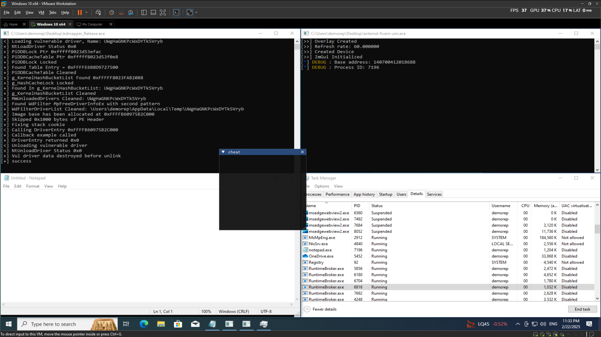

# Kern
A minimal cheat that active in kernel level. 
(on-progress) : currently only test UM initate using notepad.exe
(to-do) : maybe the usermode later will work on fivem cheats reading memory and creating an ESP

